<h1>The Perceptron Unit for Multiple Linear Regression Analysis</h1>

<p align="jutify">
    This is a perceptron unit with training algorithm for multiple linear regression analysis of data written in Python.
</p>

<h1>Mathematical Model</h1>

<p align="jutify">
    A perceptron unit with no activation function can be used to carry out multiple linear regression analysis.
    Click <a href="https://github.com/zachary-chiodini/unit-perceptron-classification">here</a> to view how the perceptron unit 
    with a stepwise activation function can be used to classify linearly separable data.
</p>
<p align="jutify">
    The perceptron unit will accept two inputs. One is a matrix <i><b>X</b></i> (1), 
    where <i>m</i> is the number of data points that will be used to train or test the model 
    and <i>n</i> is the number of independent variables, or features, that will be used by the model.
    Every element in the first column <i>x<sub>i,0</sub></i> = 1.
</p>
<hr>
<p align="center">
    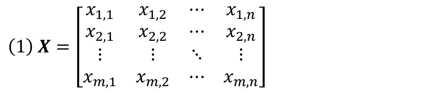
</p>
<hr>
<p align="jutify">
    The other input is a column vector of weights <b>Ω</b> (2), which contain the weight or coefficient <i>ω<sub>i</sub></i> for each feature in <i><b>X</b></i>.
    The first element <i>ω<sub>0</sub></i> = <i>b</i>.
</p>
<hr>
<p align="center">
    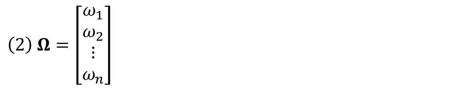
</p>
<hr>
<p align="jutify">
    The mathematical model for the perceptron <i><b>P</b></i> is simply the product of <i><b>X</b></i> and <b>Ω</b> (3), 
    where the first column in <i><b>X</b></i> and the first element in <b>Ω</b> give the bias <i>b</i>.
    Geometrically speaking, the perceptron generates a hyperplane having <i>n</n> slopes in <i>n</n> dimensions,
    where <i>b</i> is the vertical intercept. This hyperplane can be used to model data that is linearly associated.
</p>
<hr>
<p align="center">
    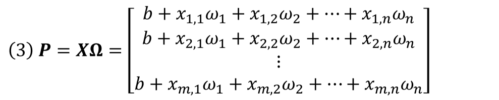
</p>

<h1>Regression Analysis</h1>

<p align="jutify">
    The column vector <b><i>Y<i/></b> (4) represents the dependent variable.
    Each element <i>y<sub>i</sub><i/> is an empirical measurement and the output of a hypothetical model after inputing values for 
    <i>x<sub>i,1</sub></i>, <i>x<sub>i,2</sub></i>, ..., <i>x<sub>i,n</sub></i>. If the hypothetical model is approximately linear,
    the perceptron <i><b>P</b></i> can be used to generate an actual model that approximates the measured outputs in <b><i>Y<i/></b>.
</p>
<hr>
<p align="center">
    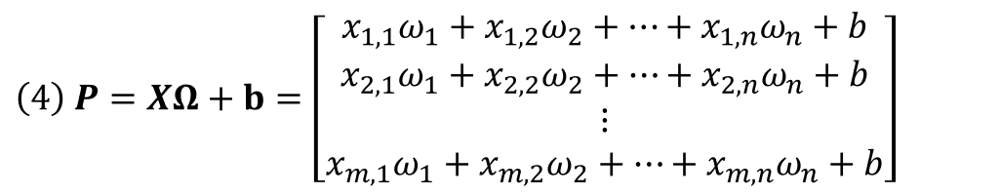
</p>
<hr>
<p align="jutify">
    However, the parameters <b>Ω</b> for this model are not yet known.
    Measuring how close a model <i><b>P</b></i> is to approximating the measured outputs
    can be achieved by calculating the sum of squared errors <i>SSE</i> (5), 
    which is the sum of the squared differences between the model's output and the measured outputs.
    These differences are called residuals. Equation (5) is also called the sum of squared residuals.
</p>
<hr>      
<p align="center">
    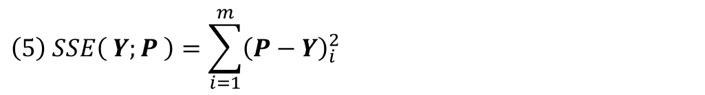
</p>
<hr>
<p align="jutify">
    The model is as close to approximating the outputs when the <i>SSE</i> reaches its minimum value.
    When the number of data points <i>m</i> = 2, a plot of the <i>SSE</i> over <i>p<sub>1</sub></i> and <i>p<sub>0</sub></i> is a paraboloid, shown below.
    The minimum of the function is easily seen. The is where the absolute value of the gradient of the 
    <i>SSE</i> with respect to each element in <i><b>P</b></i> is precisely zero. 
    Though harder to visualize, the plot is analogous for large values of <i>m</i>.
</p>
<hr>
<p align="center">
    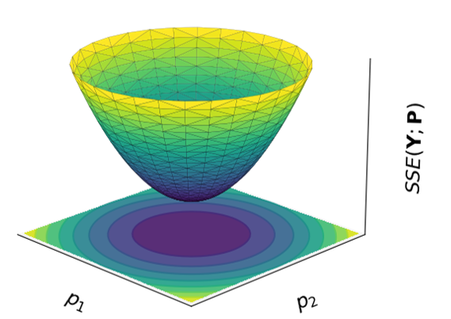
</p>
<hr>
<p align="jutify">
    Before taking the derivative, it is useful to decompose the matrix operation as shown (6). 
    Taking a partial derivative with respect to
</p>
<hr>
<p align="center">
    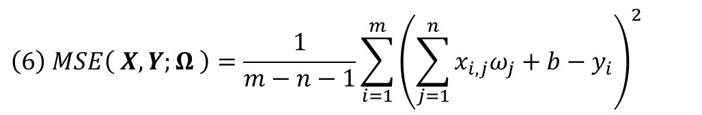
</p>
<hr>
<p align="jutify">
    Taking a partial derivative with respect to the <i>k<sup>th</sup></i> coefficient in <b>Ω</b> gives (7)
    after good use of the chain rule.
</p>
<hr>
<p align="center">
    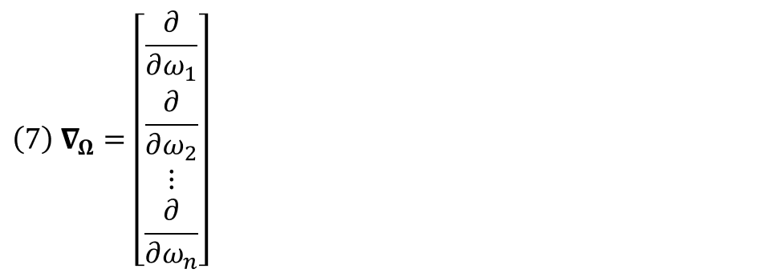
</p>
<hr>
<p align="jutify">
    The second order partial derivative with respect to the <i>k<sup>th</sup></i> coefficient in <b>Ω</b> gives (8).
    The second order derivative gives the rate of change of the slope, which in this case is a constant.
    It is also always positive, because the <i>SSE</i> in this problem is a concave up polynomial.
    Additionally, the size of this constant reflects how steep and narrow the <i>SSE</i> function is 
    with respect to <i>ω<sub>k</sub></i>.
</p>
<hr>
<p align="center">
    
</p>
<hr>
<p align="jutify">
    It is easy to see how the decomposed equations (7) and (8) can be packed back into their respective matrix counterparts for all values of <i>k</i>,
    as shown in (9) and (10).
</p>
<hr>
<p align="center">
    
</p>
<hr>
<p align="center">
    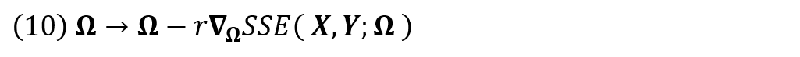
</p>
<hr>
    
<h1>Gradient Descent Training Algorithm</h1>

<p align="jutify">
    In order to find the minimum of the <i>SEE</i> function, 
    the perceptron uses the gradient descent alogithm to incrementally update each coefficient <i>ω<sub>i</sub></i> in <b>Ω</b>
    by a number proportional to the negative of the slope of <i>SEE</i> with respect to the coefficient <i>ω<sub>i</sub></i>,
    shown in (11) and (12). The constant of proportionality <i>r</i> is called the learning rate.
</p>

<p align="jutify">
    For example, if a coefficient <i>ω<sub>i</sub></i> in the model <i><b>P</b></i> is too large, 
    the derivative of <i>SEE</i> with respect to <i>ω<sub>i</sub></i> will be negative and therefore <i>ω<sub>i</sub></i> will be decreased,
    and the magnitude of the slope will correspond to how far off <i>ω<sub>i</sub></i> is from the measured value.
    As the gradient approaches the minimum of the <i>SEE</i>, the slope will approach zero and the increments will become smaller and smaller. 
</p>
<hr>
<p align="center">
    
</p>
<hr>
<p align="center">
    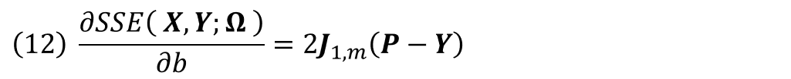
</p>
<hr>
<p align="jutify">
    The training algorithm used in "perceptron.py" is shown in (13), where ⊘ is a Hadamard division and denotes element-wise division,
    and <i>h << 1</i>.
    This training algoirthm has some additions not present in (11) and (12).
    The learning rate is divided by the second derivative of the <i>SEE</i> function,
    because a higher second derivative implies that the curvature of the <i>SEE</i> function is steeper and narrower,
    which means a smaller learning rate is necessary to avoid grossly overshooting the minimum.
    This training algorithm also utilizes the Nesterov accelerated gradient algorithm, which is beyond the scope of this page.
</p>
<hr>
<p align="center">
    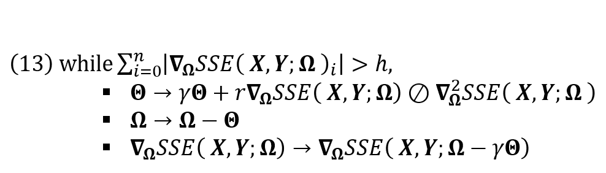
</p>

<h1>Model Statistics</h1>

<p align="jutify">
    The variance of the model predictions (14) is given by the mean square error <i>MSE</i> of the model after training is complete.
    The denominator <i>m</i> - <i>n</i> - 1 implies that the number of data points <i>m</i> used for training the model must
    be greater than the number of features <i>n</i> plus 1, which corresponds to <i>b</i>.
</p>
<hr>
<p align="center">
    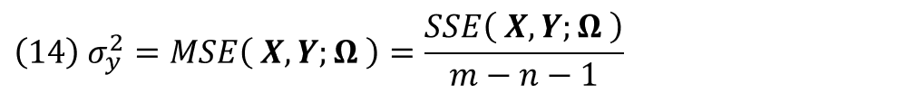
</p>
<hr>
<p align="jutify">
    The variance in the weights of the model is given by the variance covariance matrix (15).
</p>
<hr>
<p align="center">
    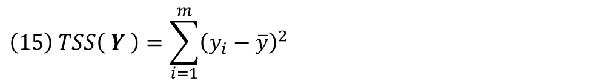
</p>
<hr>
<p align="jutify">
    The total sum of squares <i>SEE</i> (16) is the sum over all squared differences between the measured outputs and their mean.
</p>
<hr>
<p align="center">
    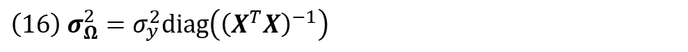
</p>
<hr>
<p align="jutify">
     The coefficient of determination (17) measures the proportion of the variance in the measured outputs that is explained by the model's inputs.
</p>
<hr>
<p align="center">
    
</p>

<h1>Try It</h1>

<p align="jutify">
     Parts per thousand concentration.
</p>

```python
import pandas as pd, numpy as np
from perceptron import Network
```

```python
df = pd.read_csv( 'air_int_incap.csv' )
df.head()
```

<div>
<table border="1" class="dataframe">
  <thead>
    <tr style="text-align: right;">
      <th></th>
      <th>category</th>
      <th>id</th>
      <th>time-to-incapacitation</th>
      <th>1000/tti</th>
      <th>CO</th>
      <th>HCN</th>
      <th>H2S</th>
      <th>HCl</th>
      <th>HBr</th>
      <th>NO2</th>
      <th>SO2</th>
    </tr>
  </thead>
  <tbody>
    <tr>
      <th>0</th>
      <td>1</td>
      <td>20.0</td>
      <td>2.36</td>
      <td>423.7</td>
      <td>164</td>
      <td>6.4</td>
      <td>0.0</td>
      <td>0.0</td>
      <td>0.0</td>
      <td>0.26</td>
      <td>0.0</td>
    </tr>
    <tr>
      <th>1</th>
      <td>1</td>
      <td>14.0</td>
      <td>2.38</td>
      <td>420.2</td>
      <td>174</td>
      <td>7.5</td>
      <td>0.0</td>
      <td>0.0</td>
      <td>5.0</td>
      <td>1.07</td>
      <td>0.0</td>
    </tr>
    <tr>
      <th>2</th>
      <td>1</td>
      <td>1.0</td>
      <td>2.61</td>
      <td>383.1</td>
      <td>96</td>
      <td>4.7</td>
      <td>0.0</td>
      <td>33.0</td>
      <td>5.0</td>
      <td>0.08</td>
      <td>0.0</td>
    </tr>
    <tr>
      <th>3</th>
      <td>1</td>
      <td>2.0</td>
      <td>3.07</td>
      <td>325.7</td>
      <td>101</td>
      <td>7.5</td>
      <td>0.0</td>
      <td>0.0</td>
      <td>7.1</td>
      <td>0.43</td>
      <td>0.0</td>
    </tr>
    <tr>
      <th>4</th>
      <td>1</td>
      <td>61.0</td>
      <td>3.07</td>
      <td>325.7</td>
      <td>142</td>
      <td>6.8</td>
      <td>0.0</td>
      <td>27.6</td>
      <td>0.0</td>
      <td>0.25</td>
      <td>0.0</td>
    </tr>
  </tbody>
</table>
</div>

```python
df[ 'CO' ] = df[ 'CO' ].apply( lambda x : np.log( x ) if x else np.NaN )
df[ 'NO2' ] = df[ 'NO2' ].apply( lambda x : np.log( x ) if x else np.NaN )
```


```python
df = df[ [ 'time-to-incapacitation', 'CO', 'NO2' ] ].dropna( axis = 0 )
```


```python
X = df[ [ 'CO', 'NO2' ] ].to_numpy()
Y = df[ [ 'time-to-incapacitation' ] ].to_numpy()
```


```python
network = Network()
network.train( X, Y, r = 0.01, h = 0.0000000001 )
```


```python
network.showModel()
```
  
    +-------+---------------------------------------------------+
    | Model | f( x1, x2 ) = 17.0(3.0) - 2.8(0.5)x1 - 0.7(0.2)x2 |
    +-------+---------------------------------------------------+
    |   b   | 17.072911943590032                                |
    +-------+---------------------------------------------------+
    |  w1   | -2.837442793250083                                |
    +-------+---------------------------------------------------+
    |  w2   | -0.7476215572004509                               |
    +-------+---------------------------------------------------+
    | STDb  | 2.5440732699408017                                |
    +-------+---------------------------------------------------+
    | STDw1 | 0.5025604849784758                                |
    +-------+---------------------------------------------------+
    | STDw2 | 0.18505563654052753                               |
    +-------+---------------------------------------------------+
    |  MSE  | 4.160156822943904                                 |
    +-------+---------------------------------------------------+
    |  R^2  | 0.6094678120459519                                |
    +-------+---------------------------------------------------+

<p align="center">
    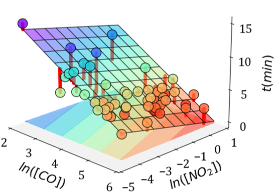
</p>
